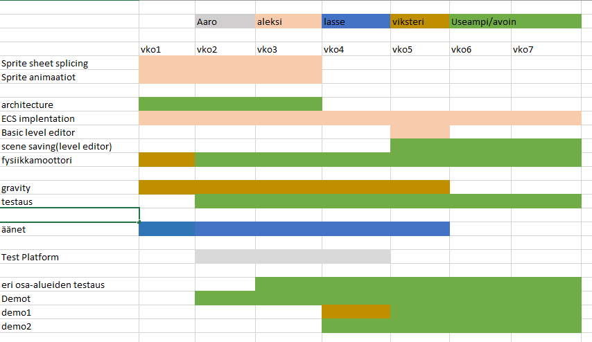

# Suunnitelma

Ajatuksena on tehdä 2d side-scroller pelimoottori.  
Sovimme keskenämme, että tulisimme kouluun keskiviikkoisin kello 9:00 ja pitäisimme scrum palaverit keskiviikkona ja perjantaina kello 9:00.  
Palaverien maksimi pituus on 15 minuuttia, mutta jos on tarvetta pidemmälle palaverille niin sitten arvioltaan 30 minuuttia.  
Aika ajoin pidämme esitelmän teamin kesken siitä, mitä olemme saaneet tehdyksi. Tämä tullaan sovituksi, joko paikan pällä tai Discordin kautta.

# Tiimi

[Aleksi Anderson](https://repo.kamit.fi/aleksiand)   **Sprite sheets, animations, architecture**

[Lasse Autio](https://repo.kamit.fi/lasseaut)   **Audio, Test platform**

[Viksteri Käppi](https://repo.kamit.fi/viksterikap)  **Lead, Physics** 

[Aaro Leskinen](https://repo.kamit.fi/aaroles)  **Physics, Test platform** 

# Ohjelmat

[Gitlab repo](https://repo.kamit.fi/)  
[CMake](https://cmake.org/)  
[Clockify](https://clockify.me/)  
[Visual Studio](https://visualstudio.microsoft.com/)  
[Discord](https://discord.com/login)

# Vaatimukset

- [ ] Architecture (ECS)

- [ ] Sprite sheet / animations 
    - [ ] Spire sheet slicing
    - [ ] animation loading
    - [ ] animation playing

- [ ] Physics (Box2d) 
    - [ ] Gravity 
    - [ ] Collision

- [ ] Audio 
    - [ ] general sounds
    - [ ] Ambient/background sounds

- [ ] scene saving to file?  
- [ ] Tilemap support (tiled?) 

- [ ] One or more examples 
    - [ ] Demo 1 (Side-scroller)
    - [ ] Demo 2 (Top-down)

- [ ] Getting started tutorial 

- [ ] API documentation 

# Aikataulu

162 h / 6 min  
7 viikkoa * 16 h/ vko = 112 h

