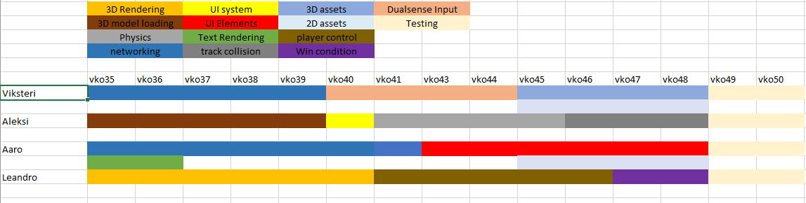

# Suunnitelma

Projektin tavoitteena tehdä 2.5D rallipeli moninpeliominaisuuksilla.  
Aloitamme koululla kello 9:00 ja pidämme scrum palaverit ennen töiden aloitusta. Sovittaessa työskentelemme etänä perjantaisin.
Palaverien maksimi pituus on 15 minuuttia, mutta jos on tarvetta pidemmälle palaverille niin sitten arvioltaan 30 minuuttia.  
Projektin puolessa välissä pidämme retropalaverin, jossa tarkastelemme tarkemmin projektin etenemistä ja toteutuneita tavoitteita.

# Tiimi

[Viksteri Käppi](https://repo.kamit.fi/viksterikap)  **Lead, networking, controller input, 2D & 3D assets** 

[Aleksi Anderson](https://repo.kamit.fi/aleksiand)   **3D model loading, UI system, Physics, track collision**

[Aaro Leskinen](https://repo.kamit.fi/aaroles)  **Networking, UI elements** 

[Leandro Lopez](https://repo.kamit.fi/leolop)  **3D Rendering, Player controller, Win conditions** 

# Ohjelmat

[Gitlab repo](https://repo.kamit.fi/)  
[CMake](https://cmake.org/)  
[Clockify](https://clockify.me/)  
[Visual Studio](https://visualstudio.microsoft.com/)  
[Discord](https://discord.com/login)

# Tavoitteet

- [x] Architecture (ECS)
    - [ ] Updates

- [x] Sprite Rendering 

- [ ] 3D Model Loading

- [ ] 3D Shading 
    
- [ ] Networking

- [ ] Improved physics
    - [ ] Track collision
    - [ ] object collision

- [x] Audio 
    - [x] general sounds
    - [x] Ambient/background sounds
    - [x] Multiple sounds

- [ ] Text Rendering

- [ ] UI system
    - [ ] UI Elements

- [ ] Player control
    - [ ] Car movement physics
    - [ ] Dualsense input

- [ ] Technical Design Document

- [ ] API documentation 

# Aikataulu

min. 180 h 
15 viikkoa

