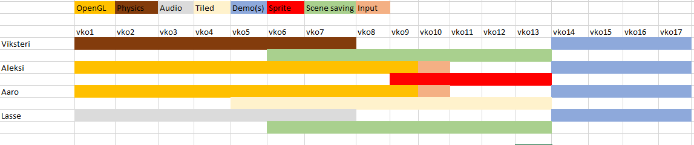

# Suunnitelma

Ajatuksena on tehdä 2d side-scroller pelimoottori.  
Sovimme keskenämme, että tulisimme kouluun torstaisin kello 9:00 ja pitäisimme scrum palaverit torstaina ja perjantaina kello 9:00.  
Palaverien maksimi pituus on 15 minuuttia, mutta jos on tarvetta pidemmälle palaverille niin sitten arvioltaan 30 minuuttia.  
Aika ajoin pidämme esitelmän tiimin kesken siitä, mitä olemme saaneet tehdyksi. Tämä tullaan sovituksi, joko paikan pällä tai Discordin kautta.

# Tiimi

[Aleksi Anderson](https://repo.kamit.fi/aleksiand)   **Sprite sheets, animations, architecture, OpenGL**

[Lasse Autio](https://repo.kamit.fi/lasseaut)   **Audio, Scene saving**

[Viksteri Käppi](https://repo.kamit.fi/viksterikap)  **Lead, Physics, Scene saving** 

[Aaro Leskinen](https://repo.kamit.fi/aaroles)  **Tiled, OpenGL** 

# Ohjelmat

[Gitlab repo](https://repo.kamit.fi/)  
[CMake](https://cmake.org/)  
[Clockify](https://clockify.me/)  
[Visual Studio](https://visualstudio.microsoft.com/)  
[Discord](https://discord.com/login)

# Vaatimukset

- [x] Architecture (ECS)

- [ ] OpenGL rendering
    - [ ] Sprite batching
    - [ ] GLFW input

- [ ] Sprite sheet / animations 
    - [x] Spire sheet slicing
    - [x] animation loading
    - [x] animation playing
    - [ ] port to OpenGL

- [ ] Physics (Box2d) 
    - [x] Gravity 
    - [ ] Collision
    - [ ] Velocity

- [ ] Audio 
    - [ ] general sounds
    - [ ] Ambient/background sounds

- [ ] Tiled support 
    - [ ] OpenGL support
    - [ ] Colliders for tilemap

- [ ] One or more examples 
    - [ ] Demo 1 (Side-scroller)

- [ ] Scene Saving

- [ ] Getting started tutorial 

- [ ] API documentation 

# Aikataulu

min. 200 h 
17 viikkoa * 16 h/ vko = 272 h

